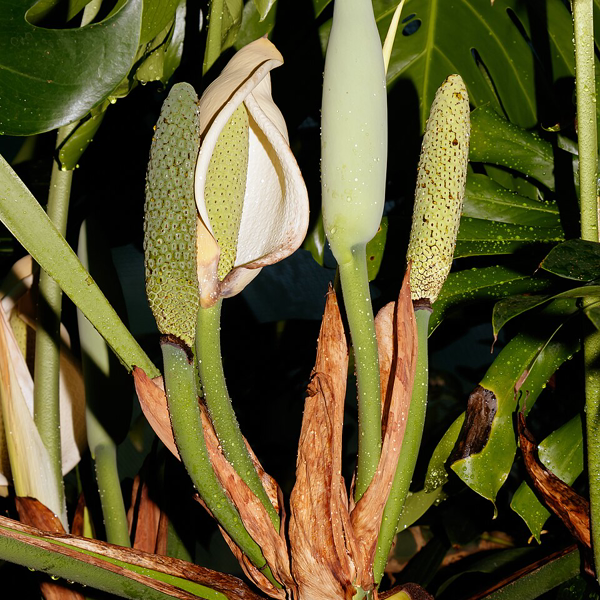

# FCH Plant Monitor Card

A lightweight custom Lovelace card for Home Assistant's built-in [Plant Monitor](https://www.home-assistant.io/integrations/plant/) integration. It displays plant readings and their configured thresholds without HACS, external frontend dependencies, or a build step.



## Features

- Works with the built-in `plant` integration
- Local plant thumbnail or custom image
- Moisture, temperature, conductivity, and brightness readings
- Threshold visualization with healthy and problem colors
- Plant health status (`ok` / `problem`)
- Battery-level indicator
- Uses Home Assistant theme variables

## Install manually

1. Download `fch-plant-monitor-card.js` and the `plants/` directory from a release.
2. Copy them to your Home Assistant `www` directory:

   ```text
   <config>/www/fch-plant-monitor-card.js
   <config>/www/plants/
   ```

3. In **Settings → Dashboards → Resources**, add this JavaScript module:

   ```text
   /local/fch-plant-monitor-card.js
   ```

4. Refresh the browser, then add the card to a dashboard.

### Install from a release in Home Assistant

The optional configuration at [ha-scripts/home-assistant-install-release.yaml](ha-scripts/home-assistant-install-release.yaml) downloads the latest release to `/config/www`. Copy its `shell_command` and `script` sections into your Home Assistant configuration, restart Home Assistant, and run **Install FCH Plant Monitor Card** from **Developer Tools → Actions**.

## Card configuration

```yaml
type: custom:fch-plant-monitor-card
entity: plant.monstera
name: Living room Monstera
image: /local/plants/monstera.png
show_bars:
  - moisture
  - temperature
  - conductivity
  - brightness
```

| Option | Required | Default | Description |
| --- | --- | --- | --- |
| `entity` | Yes | — | A built-in `plant.*` entity. |
| `name` | No | Entity friendly name | Heading displayed by the card. |
| `image` | No | Entity picture, if present | A local or remote image URL. Use `/local/plants/<file>.png` for the included images. |
| `show_bars` | No | All supported bars | List of bars to display: `moisture`, `temperature`, `conductivity`, `brightness`. |
| `display_type` | No | `full` | Use `compact` for a smaller portrait and one meter per row. |
| `bars_per_row` | No | 2 in full mode, 1 in compact mode | Number of meters per row: `1` or `2`. |
| `hide_units` | No | `false` in full mode, `true` in compact mode | Hides units beside readings and threshold ranges. |
| `hide_image` | No | `false` | Replaces the plant image with a leaf icon. |

The card reads the sensor entity IDs and `min_*` / `max_*` thresholds from the selected plant entity. Configure those values through the standard [Plant Monitor integration](https://www.home-assistant.io/integrations/plant/) YAML configuration.

## Local development and testing

The repository includes a Home Assistant test configuration with two simulated plants.

1. Open this repository in VS Code.
2. Run **Dev Containers: Reopen in Container**.
3. Wait for Home Assistant to start, then open the forwarded port `8123`.
4. Complete Home Assistant onboarding.
5. Open the **Plants** dashboard.
6. Change the `input_number` helpers in **Developer Tools → States** to move sensor values inside or outside their thresholds.

The development container mounts [src](src) at Home Assistant's `/config/www`, so edits to [src/fch-plant-monitor-card.js](src/fch-plant-monitor-card.js) and the local images are available after refreshing the browser.

## Create a release

Push a tag in the `v<major>.<minor>` form, such as `v1.0`. The GitHub Actions workflow packages the complete [src](src) directory into `fch-plant-monitor-card.zip` and creates a GitHub release.

## Image attribution

See [src/plants/ATTRIBUTION.md](src/plants/ATTRIBUTION.md) for the source and license of included plant images.
